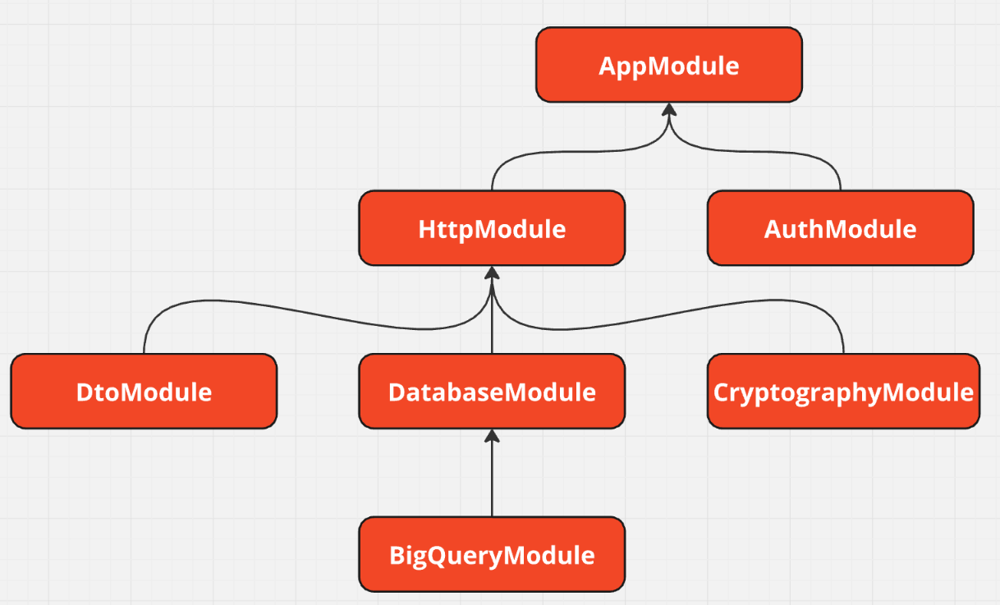

# Infraestrutura

Essa é a camada mais externa da aplicação. Responsável por gerir as requisições, se comunicar com o banco de dados, gerir a lógica de autenticação e tratar os dados para apresentação ou inserção.

Para fazer essa gestão há módulos de autenticação, criptografia, banco de dados e http.

- O de autenticação configura a geração, criptografia e inserção de dados no _cccess token_.
- O módulo de criptografia faz o relacionamento dos casos de uso com as ferramentas utilizadas para codificar e encriptar os dados.
- O módulo do banco de dados é responsável por implementar e configurar os contratos de repositório da camada de uso. Além disso, faz a transformação dos dados entre a camada de domínio e o banco de dados. Há uma sessão só para tratar de suas especificidades.
- O módulo de http faz a gestão das requisições que chegam à aplicação através dos controladores, pipes e apresentadores. Também haverá uma sessãoa baixo para esse módulo.

Além desses módulos, há nessa pasta os dois arquivos mais importantes dessa aplicação. O [main](../src/infra/main.ts), que configura o recebimento de requisições ao ouvir uma porta e aponta para o [app.module](../src/infra/app.module.ts) para que ele direcione as requisições para os controladores responsáveis.

## Módulos

No Nestjs, os módulos organizam quais arquivos devem ser utilizados e suas dependências. Sendo importantes na agregação dos componentes da aplicação. Abaixo serão listados todos os módulos da dessa aplicação e o que fazem.

| Módulo                                                                        | Descrição                                                                             | Módulos Importados                             |
| :---------------------------------------------------------------------------- | :------------------------------------------------------------------------------------ | :--------------------------------------------- |
| [AppModule](../src/infra/app.module.ts)                                       | Principal módulo da aplicação                                                         | HttpModule e AuthModule                        |
| [AuthModule](../src/infra/auth/auth.module.ts)                                | Gere a autenticação para acessar as rotas                                             | -                                              |
| [HttpModule](../src/infra/http/http.module.ts)                                | Agrega todos os controladores e as dependências para interagir com o banco de dados   | DatabaseModule, CryptographyModule e DtoModule |
| [DatabaseModule](../src/infra/database/database.module.ts)                    | Reúne e relaciona todos os repositórios com seus contratos da camada de domínio       | BigQueryModule                                 |
| [CryptographyModule](../src/infra/cryptography/cryptography.module.ts)        | Associa as ferramentas de encriptação com os seus contratos da camada de domínio      | -                                              |
| [DtoModule](../src/infra/http/swagger%20dto%20and%20decorators/dto.module.ts) | Reúne todos as classes DTO que possuem os parâmetros de recebimento dos controladores | -                                              |
| [BigQueryModule](../src/infra/database/bigquery/bigquery.module.ts)           | Agrega todas as classes de esquemas das tabelas do banco de dados do Bigquery         | -                                              |

### Diagrama dos módulos



## Database

A camada do banco de dados está dividida em três seguimentos (esquemas, repositórios, mapeadores) dentro do Bigquery, que atualmente é o único banco de dados que essa aplicação interage.

### [Schemas](../src/infra/database/bigquery/schemas/)

Essa parte do projeto possui os esquemas de todas as tabelas do banco de dados. Além disso, o [BigqueryShemas](../src/infra/database/bigquery/schemas/bigquery%20schemas/bigquerySchemas.ts) contém todas os esquemas no padrão aceito pela API do Bigquery para que o BigqueryMethods não precise enviar uma requisição a mais a se precisar verificar o esquema de uma tabela.

Esses Esquemas estendem o BigqueryMethods para utilizar seus métodos para essa tabela e enviam também o nome da tabela no bancod de dados. Além de trazer já os relacionamentos na própria interface. Porém, ao utilizar uma consulta também aparecem, o que deve ser modificado no futuro.

### [Repositories](../src/infra/database/bigquery/repositories/)

Os repositórios são responsáveis por fazer a comunicação do projeto com o banco de dados, que nesse caso é o Bigquery do Google Cloud.

Aqui os contratos dos repositórios criados na camada de domínio são implementados utilizando os métodos de pesquisa para o Bigquery, que é a única dependência injetada.

Os métodos aqui são iguais aos utilizados nos [repositórios de teste](../test/repositories)

### [Mappers](../src/infra/database/bigquery/mappers/)

Essas classes fazem a transformação dos dados da camada de domínio para o bigquery e vice-versa. Todos esses _mappers_ possuem até dois métodos:

- `toDomain`: Transforma os dados que veem do banco de dados para a camada de domínio.
- `toBigquery`: Transforma os dados que veem da camada de domínio para o formato aceito pelo Bigquery.

Além disso, cada _Value Object_ das entidades da aplicação possuem seu próprio _mapper_. Onde somente o método `toDomain` é utilizado.

## HTTP

Além dos arquivos `main` e `app.module` estarem localizados nessa área da aplicação, também temos os controladores, os pipes, os arquivos de apresentação e os arquivos de documentação do Swagger.

### [Controllers](../src/infra/http/controllers/)

Os controladores são responsáveis por receber as requisições, tratar esses dados, utilizar os casos de uso necessários e responder essas requisições. As pastas foram divididas da mesma maneira que a camada de domínio, sendo assim, casa caso de uso tem o seu próprio controlador.

Eles utilizam o pipe de validação para verificar se os dados que estão sendo recebidos condizem com esperados, instanciam o caso de uso e usam o método `execute`, verificam se o resultado foi um sucesso ou falha e envio a resposta com base nisso.

### [Pipes](../src/infra/http/pipes/)

Nessa sessão tem apenas o pipe de validação do Zod. Ele recebe um schema de validação e verifica se os dados recebidos estão de acordo com esse esquema. Caso não esteja de acordo, ele envia o erro de código 400 com a mensagem de erro do Zod.

### [Presenters](../src/infra/http/presenters/)

Esses arquivos são utilizados para transformar os objetos de dados antes de enviar pela resposta da requisição. Ele só é utilizado caso o controlador seja do tipo _Get_ e a requisição tenha sido bem sucedida. Ele é essencial para controlar quais informações o cliente da API irá receber para não enviarmos todos os dados como no caso abaixo, onde não era necessário enviar todos os dados de todas as cinco entidades que foram consultadas pela requisição

```typescript
export class MovimentationWithDetailsPresenter {
  static toHTTP(movimentation: MovimentationWithDetails) {
    return {
      id: movimentation.movimentationId.toString(),
      createdAt: movimentation.createdAt,
      observation: movimentation.observation,
      value: movimentation.value,
      base: {
        id: movimentation.base.id.toString(),
        baseName: movimentation.base.baseName,
      },
      user: {
        id: movimentation.storekeeper.id.toString(),
        name: movimentation.storekeeper.name,
        email: movimentation.storekeeper.email,
      },
      project: {
        id: movimentation.project.id.toString(),
        project_number: movimentation.project.project_number,
      },
      material: {
        id: movimentation.material.id.toString(),
        code: movimentation.material.code,
        description: movimentation.material.description,
        unit: movimentation.material.unit,
        type: movimentation.material.type,
      },
    };
  }
}
```
